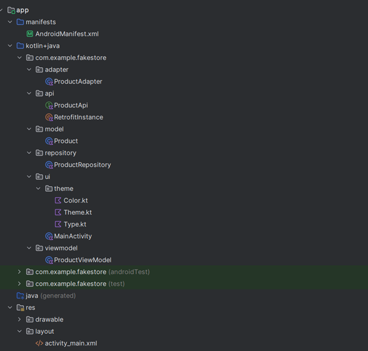
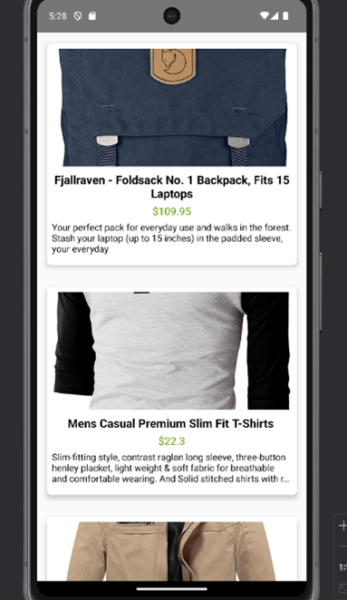
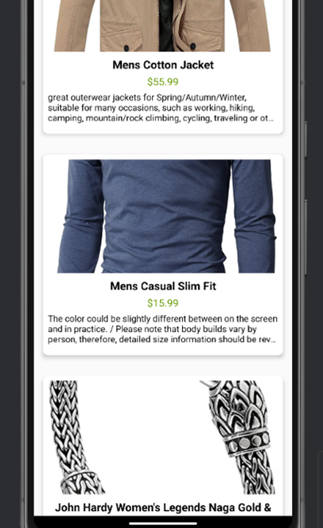
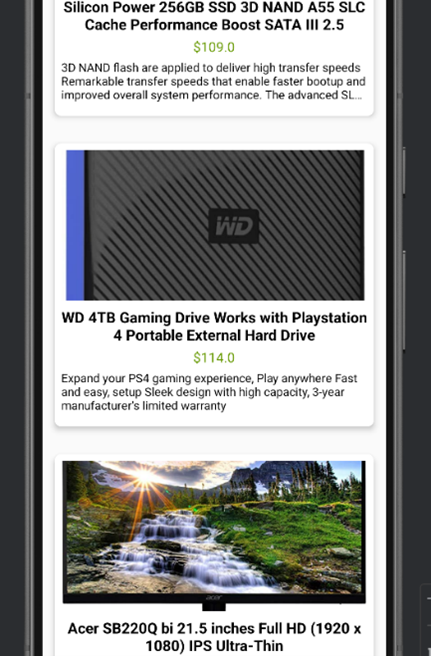
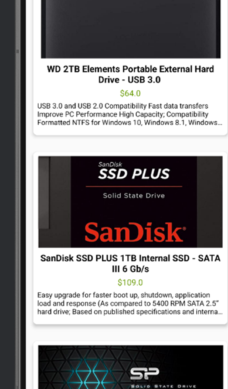

Case Study
Proje Mimarisi (MVVM)

Mimari Yapı

com.example.fakestore
 ├── adapter
 │   └── ProductAdapter.kt      # RecyclerView Adapter + Glide ile resim
 ├── api
 │   ├── ProductApi.kt          # Retrofit endpoint tanımı
 │   └── RetrofitInstance.kt    # Singleton Retrofit yapılandırması
 ├── model
 │   └── Product.kt             # Ürün veri sınıfı (Model)
 ├── repository
 │   └── ProductRepository.kt   # API çağrılarının yönetimi (Repository)
 ├── ui
 │   └── MainActivity.kt        # Ana ekran (View)
 └── viewmodel
     └── ProductViewModel.kt    # ViewModel, LiveData yönetimi

Model
Product.kt → FakeStore API’den gelen ürün verilerini temsil eden veri sınıfı.

View (UI)
MainActivity.kt → Ürün listesini gösteren ana ekran.
ProductAdapter.kt → RecyclerView içinde görüntülenecek her bir ürün kartının bağlanması.
XML dosyaları (activity_main.xml, item_product.xml) → UI bileşenlerinin görsel tanımları.

ViewModel
ProductViewModel.kt → API’den gelen verileri yönetir, LiveData ile güncellenen verileri UI’a iletir.

Repository
ProductRepository.kt → ViewModel ile API arasındaki veri trafiğini yönetir, Retrofit çağrılarını gerçekleştirir.
Bu yapı, Model ve View bileşenlerinin birbirlerinden gevşek bağlı (loose coupling) olmasını ve test edilebilirliğin artmasını sağlar.

Kullanılan Teknolojiler

Retrofit
•	Açıklama: HTTP isteklerini basitleştirmeye yarayan, Square tarafından geliştirilmiş bir kütüphane.
•	Kullanım:
o	RetrofitInstance.kt dosyasında BASE_URL = "https://fakestoreapi.com/" tanımlanır.
o	ProductApi.kt içinde @GET("products") gibi endpoint’ler belirtilir.
o	ProductRepository.kt bu API’yi çağırarak veriyi ViewModel’e iletir.

Glide
•	Açıklama: Resim yükleme ve önbellekleme (cache) kütüphanesi.
•	Kullanım:
o	ProductAdapter.kt içerisinde Glide.with(context).load(url).into(imageView) yöntemiyle ürün resimleri indirip ImageView’a yüklenir.
o	Performans sorunlarını ve tekrar indirme ihtiyacını azaltır.

RecyclerView
•	Açıklama: Liste veya grid yapılarını verimli bir şekilde göstermek için kullanılan bir Android bileşeni.
•	Kullanım:
o	MainActivity.kt içinde LinearLayoutManager ile dikey liste olarak ayarlanır.
o	ProductAdapter.kt ile veri bağlanması ve ViewHolder yönetimi yapılır.
ViewBinding

•	Açıklama: XML’de tanımlanan görünümleri (views) daha güvenli ve kolay erişilebilir hale getiren bir mekanizma.
•	Kullanım:
o	build.gradle içinde buildFeatures { viewBinding = true }.
o	MainActivity.kt ve adapter dosyalarında inflate(...) yöntemiyle oluşturulan binding nesneleri kullanılır (örneğin ItemProductBinding).

Nasıl Çalışır?
Uygulama Açıldığında
o	MainActivity (View) → ProductViewModel’dan verileri çekmesini ister.
ViewModel
o	fetchProducts() metodu ile ProductRepository üzerinden API çağrısı başlatır.
Repository
o	RetrofitInstance.api.getProducts() çalıştırarak FakeStore API’den gelen JSON yanıtını Product listesine dönüştürür.
Veriler Geldiğinde
o	ViewModel, LiveData<List<Product>> olarak listeyi günceller.
o	MainActivity bu listeyi gözlemlediği için otomatik olarak güncellenir ve RecyclerView adaptörüne yeni listeyi verir.
Görünümde
o	ProductAdapter, her bir ürün öğesi için item_product.xml layout’unu kullanarak, resimleri Glide ile indirir ve TextView gibi bileşenlere değerleri atar.
Bu sayede kullanıcı, ana ekranda ürün listesini (resimleri, isimleri, fiyatları, açıklamaları) görür.

 
 
 
 
 

Ekran Görüntüleri

MVVM mimarisini uygulayan bir proje düzeni
 

